# AI DevOps Operations Platform

[](https://github.com/PMooney03/AIDevOpsPlatform/actions/workflows/ci.yml)

ASP.NET Core operations platform that monitors services and containers, records incidents, explains them with a local LLM (Ollama), and requires a human to approve any remediation. The model never runs shell commands, Docker, or remediations.

## Why I built it

Internal DevOps work is mostly detection, evidence, and careful change. This repo combines C#, background monitoring, observability, CI, and constrained AI — not a chatbot with shell access.

## Architecture

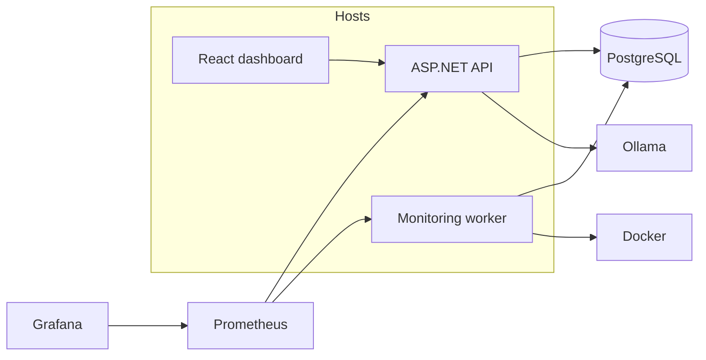

Details: `docs/ARCHITECTURE.md`.

## Implemented features

- Service registry and HTTP health monitoring with configurable thresholds
- Docker inspect, restart-threshold / stop / unhealthy incidents
- Incident CRUD, resolve, similar-incident ranking
- Ollama incident analysis (validated JSON, fallback if the model is down)
- Deployment records and time-window correlation
- Human-approved remediations (health check, refresh, logs, restart)
- JWT roles: Viewer, Operator, Administrator
- Prometheus + Grafana, structured logs, GitHub Actions CI
- React operations dashboard (polling, not SignalR)
- Demo chaos service (`/chaos/*` marked development-only)

## Technology stack

.NET 10, C# 14, EF Core, PostgreSQL, Docker Compose, xUnit, OpenTelemetry/Prometheus, Grafana, React 19 + TypeScript, Ollama.

## Running locally

```powershell
copy .env.example .env
docker compose up --build
```

| URL | Purpose |
|---|---|
| http://localhost:8081 | Dashboard |
| http://localhost:8080/swagger | API |
| http://localhost:8080/health/ready | API + PostgreSQL |
| http://localhost:3000 | Grafana (`admin` / `admin`) |
| http://localhost:9090 | Prometheus |

Demo logins (local only): `operator` / `LocalOperator-Devops9`, `admin` / `LocalAdmin-Devops9`, `viewer` / `LocalViewer-Devops9`. Viewer cannot propose or approve remediations.

Host API against Compose Postgres: `dotnet run --project src/DevOps.Api` (Development enables JWT; same demo users).

Compose starts **Ollama** and pulls `llama3.2` (3B) on first run. Docker Desktop on Windows typically runs the model on CPU; 3B finishes inside the proxy timeout. `llama3.1` (8B) is optional via `OLLAMA_MODEL` if you warm it first. The worker never calls the model. Open an incident and click **Run analysis**. Tests and CI still run with Ollama off (`docs/incident-analysis.md`).

Compose starts healthy platform services plus **intentional demo faults** (`demo-unhealthy` always returns HTTP 500, `demo-restarting` crash-loops). Open incidents and Unhealthy tiles are the product detecting those targets, not a broken stack. Details: `docs/DEMO.md`.

## Screenshots

Files in `Images/`. Open incidents and Unhealthy tiles are **intentional demo faults**.

### Login

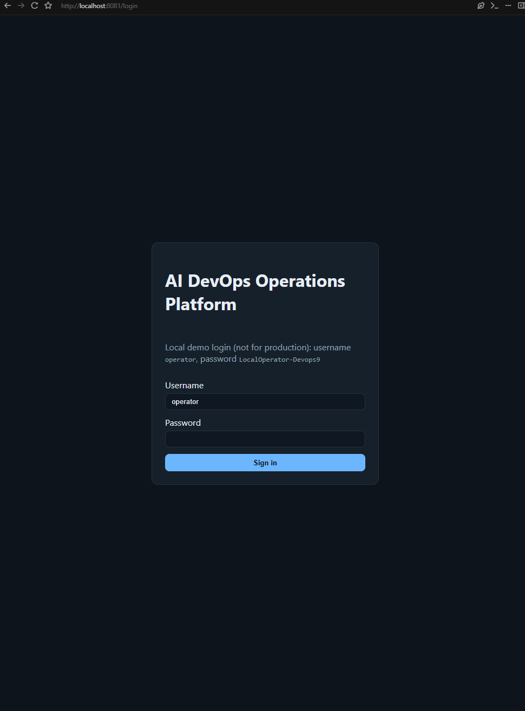

JWT demo login. Caption on the form is the Operator account; Viewer and Administrator are listed above.

### System overview

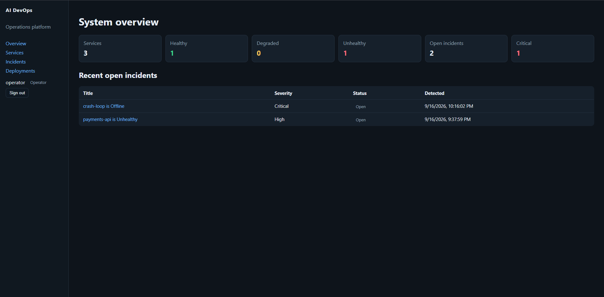

Live counts from the API: registered services, `payments-api` Unhealthy (nginx 500), crash-loop Offline, open incidents.

### Incidents

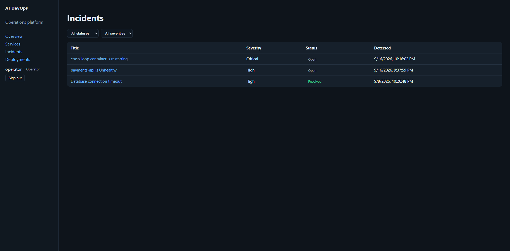

Filterable list. Open rows come from the worker. **Database connection timeout** is seed history for similar-incident ranking.

### Incident: payments-api (Ollama)

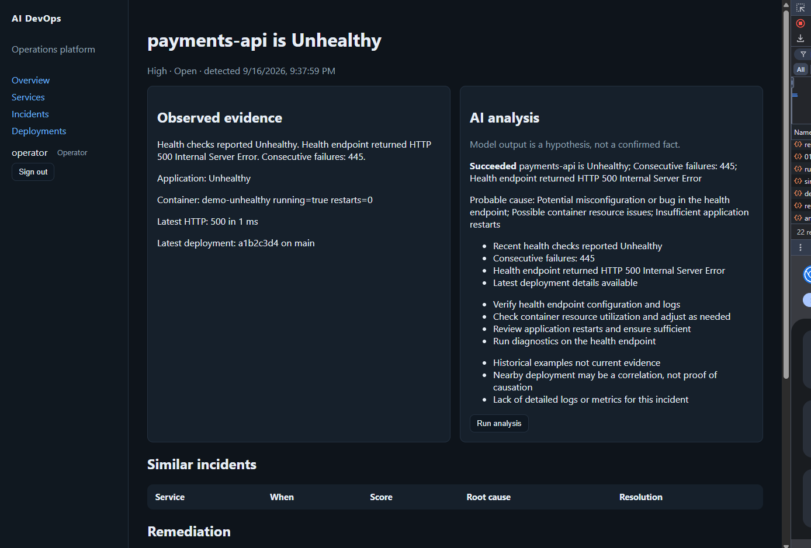

Left: observed evidence (HTTP 500, consecutive failures, container inspect, latest deployment SHA). Right: **Run analysis** with `llama3.2` — a stored hypothesis, not a confirmed fact. `a1b2c3d4` is seed data.

### Incident: crash-loop

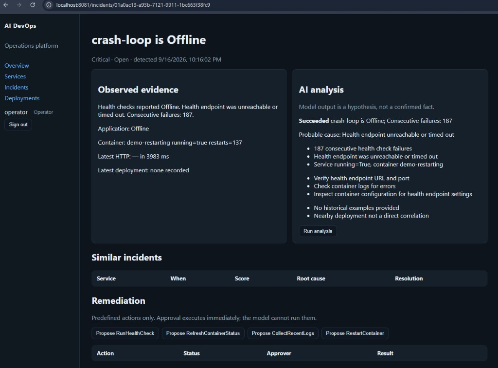

Alpine `demo-restarting` exits in a loop. The worker marks **Offline** when `/health` times out. `restarts=137` is Docker inspect; `running=true` is between crash cycles. The model reports unreachable health; the designed cause is `sleep 3; exit 1`.

### Remediation (human approval)

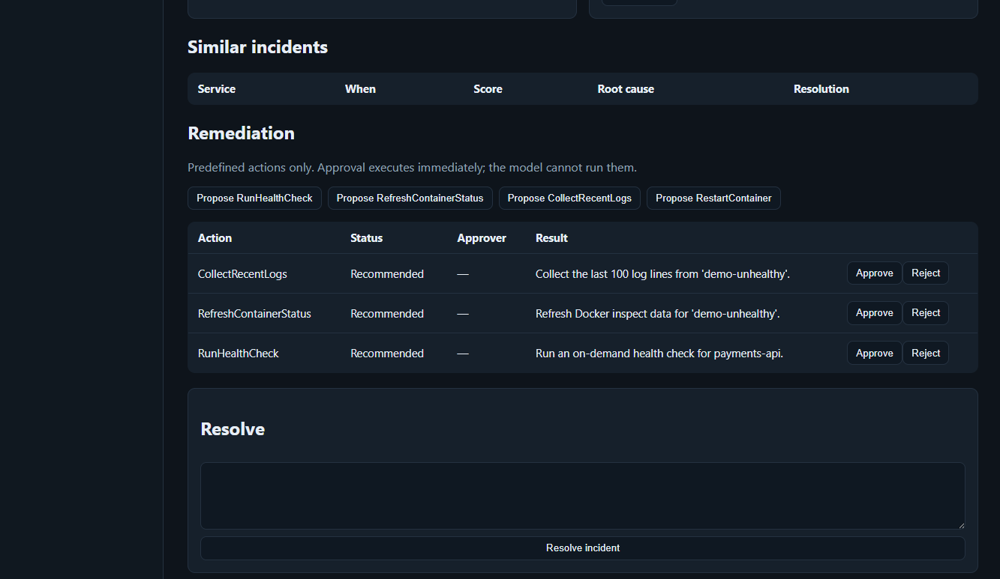

Closed set of actions (`RunHealthCheck`, `RefreshContainerStatus`, `CollectRecentLogs`, `RestartContainer`). Rows stay **Recommended** until an Operator/Admin clicks **Approve** or **Reject**. Approve executes immediately; the LLM cannot.

### Service: payments-api

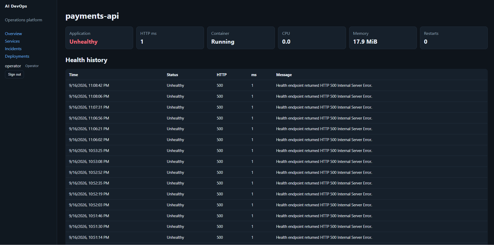

Health history for the HTTP-500 target. Container stays **Running** (nginx is up) while the application is **Unhealthy**. Low CPU/memory from inspect is expected.

### Deployments

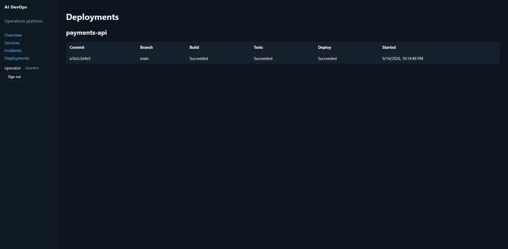

Records used for time-window correlation. SHAs here are **seed/demo**, not commits from this repo.

### Prometheus

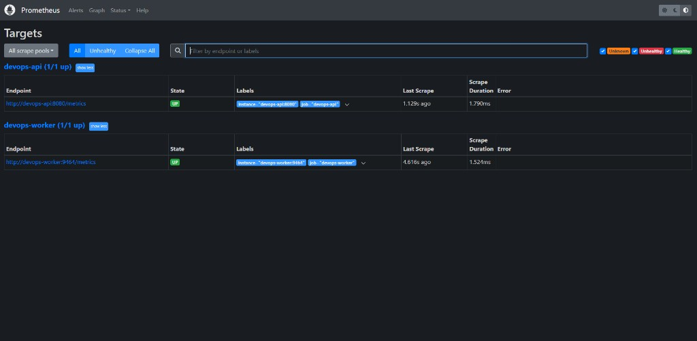

http://localhost:9090/targets. Both scrape jobs **UP**: API `/metrics` and worker `:9464/metrics`. Grafana reads this Prometheus, not the dashboard API.

### Grafana

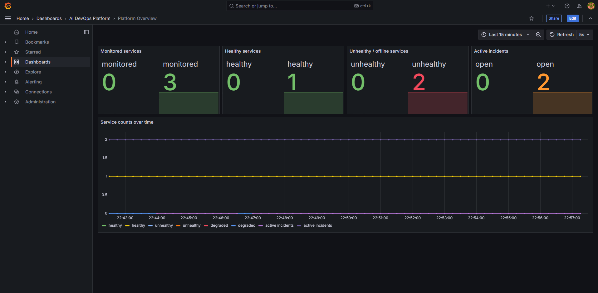

Prometheus **Platform Overview** (`admin` / `admin`). Stat panels may show a duplicate empty series; the time series tracks healthy / unhealthy / open incidents.

### Swagger

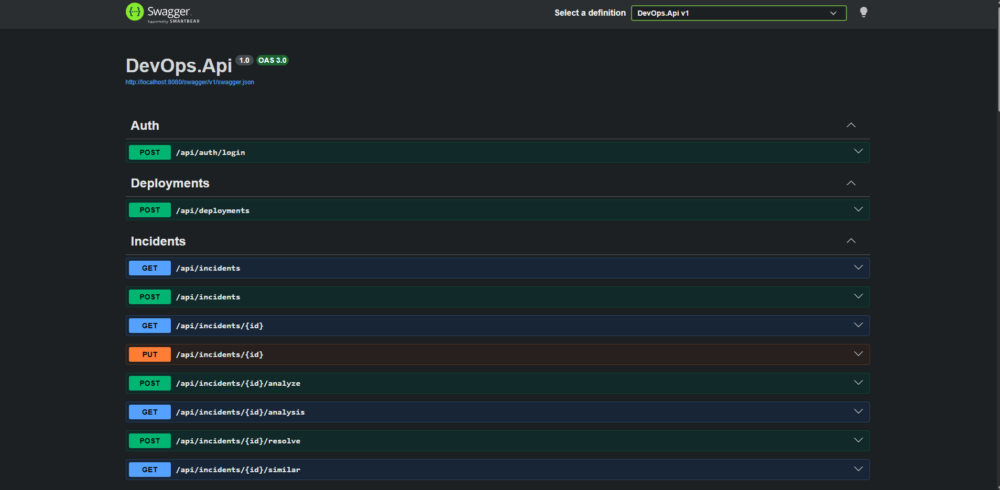

OpenAPI at http://localhost:8080/swagger. Protected routes need a JWT from `POST /api/auth/login`.

## Testing

```powershell
dotnet test
cd frontend/dashboard; npm install; npm test; npm run build
```

Unit tests do not need PostgreSQL, Docker, Ollama, or the network. API tests use EF InMemory.

## Documentation

- `docs/DEMO.md` — four fault scenarios
- `docs/SECURITY.md` — roles and AI safety
- `docs/AI-DESIGN.md` — prompts and fallback
- `docs/MONITORING.md` — health rules
- `docs/INTERVIEW.md` — talking points
- `docs/observability.md` / `docs/container-monitoring.md` / `docs/ci-cd.md`
