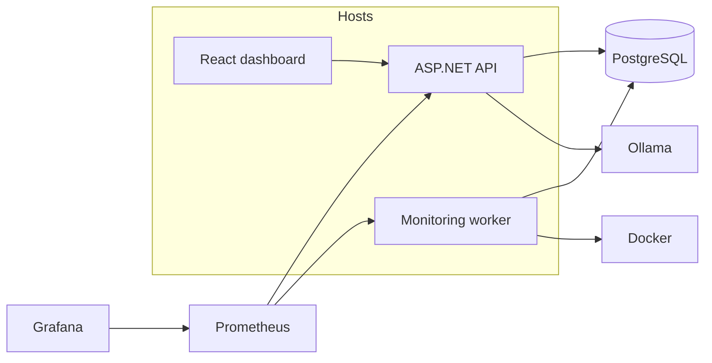
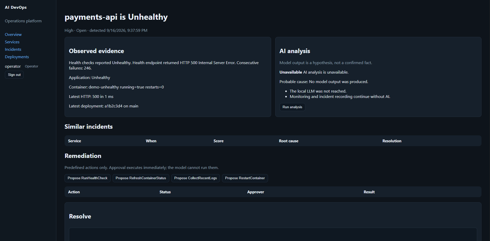

# AI DevOps Operations Platform

ASP.NET Core operations platform that monitors services and containers, records incidents, explains them with a local LLM (Ollama), and requires a human to approve any remediation.

## Why I built it

Internal DevOps work is mostly detection, evidence, and careful change. This repo combines C#, background monitoring, observability, CI, and constrained AI — not a chatbot with shell access.

## Architecture



Details: `docs/ARCHITECTURE.md`.

## Implemented features

- Service registry and HTTP health monitoring with configurable thresholds
- Docker inspect, restart-threshold / stop / unhealthy incidents
- Incident CRUD, resolve, similar-incident ranking
- Ollama incident analysis (validated JSON, fallback if the model is down)
- Deployment records and time-window correlation
- Human-approved remediations (health check, refresh, logs, restart)
- JWT roles: Viewer, Operator, Administrator
- Prometheus + Grafana, structured logs, GitHub Actions CI
- React operations dashboard (polling, not SignalR)
- Demo chaos service (`/chaos/*` marked development-only)

## Technology stack

.NET 10, C# 14, EF Core, PostgreSQL, Docker Compose, xUnit, OpenTelemetry/Prometheus, Grafana, React 19 + TypeScript, Ollama.

## Running locally

```powershell
copy .env.example .env
docker compose up --build
```

| URL | Purpose |
|---|---|
| http://localhost:8081 | Dashboard (`operator` / `LocalOperator-Devops9`) |
| http://localhost:8080/swagger | API |
| http://localhost:8080/health/ready | API + PostgreSQL |
| http://localhost:3000 | Grafana (admin / admin) |
| http://localhost:9090 | Prometheus |

Host API against Compose Postgres: `dotnet run --project src/DevOps.Api` (Development enables JWT; same demo users).

Compose starts **Ollama** and pulls `llama3.1` (8B, ~5 GB) on first run. The worker never calls the model. Open an incident and click **Run analysis**. Tests and CI still run with Ollama off (`docs/incident-analysis.md`).

Compose starts healthy platform services plus **intentional demo faults** (`demo-unhealthy` always returns HTTP 500, `demo-restarting` crash-loops). Open incidents and Unhealthy tiles are the product detecting those targets, not a broken stack. Details: `docs/DEMO.md`.

## Screenshots

Images live in `Images/` with the names used below.

### System overview


Home page after login. Counts are live from the API: three registered services, one healthy, one unhealthy (`payments-api` → nginx 500), two open incidents (HTTP failure plus the crash-loop container).

### Incidents


Filterable incident list. Open rows are produced by the worker; **Database connection timeout** is seed history so similar-incident ranking has something to score against.

### Incident: payments-api



Evidence is collected independently of the LLM (status, HTTP 500, consecutive failures, container inspect, latest deployment SHA). **AI analysis is unavailable** in this screenshot because it was taken before Compose included Ollama. After `docker compose up`, **Run analysis** calls `llama3.1` and stores a hypothesis (not a confirmed fact). Remediation buttons only *propose* actions — an Operator/Admin must approve before anything runs.

### Service: payments-api


Per-service health history for the demo HTTP-500 target. The container stays **Running** (nginx is up) while the application is **Unhealthy** because `/health` returns 500. CPU near 0 and memory from Docker inspect are expected for that tiny container.

### Deployments


Deployment records used for time-window correlation on incidents. `a1b2c3d4e5` is **seed/demo data**, not a git commit from this repo.

### Grafana


Prometheus-backed **Platform Overview** dashboard (sign in as `admin` / `admin`). Stat panels can show a zero series next to the live series (duplicate empty query); the time series still tracks healthy / unhealthy / open incidents.

### Swagger


ASP.NET Core OpenAPI at http://localhost:8080/swagger: auth, incidents, analysis, remediations, services, deployments. JWT from `POST /api/auth/login` is required for the protected routes.

## Testing

```powershell
dotnet test
cd frontend/dashboard; npm install; npm test; npm run build
```

Unit tests do not need PostgreSQL, Docker, Ollama, or the network. API tests use EF InMemory.

## Documentation

- `docs/DEMO.md` — four fault scenarios
- `docs/SECURITY.md` — roles and AI safety
- `docs/AI-DESIGN.md` — prompts and fallback
- `docs/MONITORING.md` — health rules
- `docs/INTERVIEW.md` — talking points
- `docs/observability.md` / `docs/container-monitoring.md` / `docs/ci-cd.md`

## Suggested commit message

`feat: add dashboard, remediation approval, auth, and demo chaos environment`
