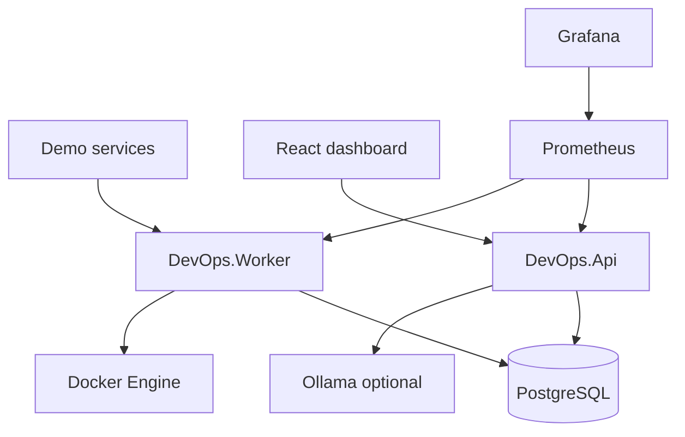

# Architecture

The platform is a .NET 10 operations system: a worker polls health and Docker, an API stores incidents and analysis, PostgreSQL holds state, Prometheus/Grafana show metrics, Ollama optionally explains incidents, and a React dashboard is the operator UI.

## Why the worker is separate from the API

HTTP request handling should stay independent of polling. If the dashboard is busy, monitoring still runs. If Ollama is slow, the worker is not blocked; analysis is an explicit API call.

## Layering

- **Core** — entities and enums only
- **Application** — use cases, validation, scoring
- **Infrastructure** — EF Core, Docker.DotNet, HTTP probes
- **AI** — Ollama HTTP adapter behind `IIncidentAnalyzer`
- **Api / Worker** — hosts

Docker types never appear in Core. The LLM never receives a shell.
